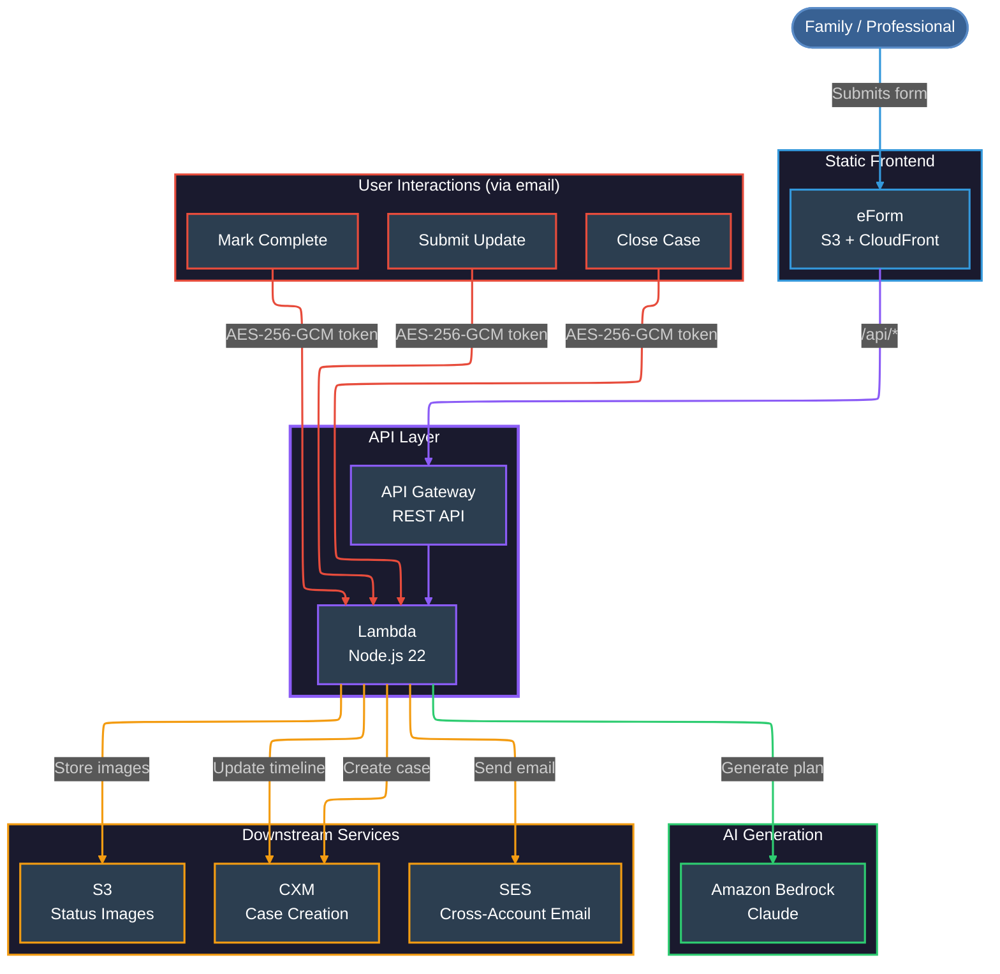

# AI Packages — Family Support System

An AI-driven case management system that generates personalised action plans for families needing support, with automated case creation and interactive email tracking.

**For the complete case study with detailed technical analysis, see [CASE_STUDY.md](CASE_STUDY.md)**

**⚠️ Note: This is a sanitized version for portfolio purposes. All sensitive data, URLs, and identifiers have been anonymized.**

## Overview

Families describe their circumstances via a web form. AI generates a tailored action plan (3-8 practical steps with links to local services). A case is created automatically in the council's CRM, and the user receives an email with encrypted interactive links to track progress.

## Architecture

## Features

- **AI Action Plan Generation** — Bedrock Claude generates 3-10 tailored actions with relevant local service links
- **Automatic Case Creation** — Cases created in CRM via API with full field mapping
- **Encrypted Email Links** — AES-256-GCM tokens hide case references in URLs
- **Action Completion Tracking** — Users mark actions complete via email (GET/POST confirmation pattern)
- **Progress Updates** — Free-text updates submitted via email links, logged to case timeline
- **Case Closure** — Users can close their case when they've received enough support
- **Cross-Account Email** — SES delivery via assumed role in separate AWS account
- **Custom Domain** — CloudFront with path-based routing (`/api/*` → API Gateway, `/*` → S3)

## API Endpoints

| Method | Path | Purpose |
|--------|------|---------|
| POST | `/call-ai` | Generate action plan from circumstances |
| POST | `/create-case` | Create CRM case + send email |
| GET/POST | `/action-complete` | Mark action as done |
| GET/POST | `/action-update` | Submit progress update |
| GET/POST | `/close-case` | Close the case |
| GET | `/status/{ref}/action-{n}.png` | Status image (tick/cross) with cache-busting |
| POST | `/webhook` | Receive CRM event notifications |

## Security

- **AES-256-GCM encryption** for all email link tokens
- **XSS protection** on all user inputs
- **SSRF protection** on webhook handler
- **Input validation** with length limits
- **UTF-8 form handling** for international characters
- **CORS restricted** to specific allowed origins

## Technology Stack

- **AWS Lambda** (Node.js 22)
- **Amazon Bedrock** (Claude) for AI generation
- **API Gateway** (REST API)
- **CloudFront** with custom domain + path-based routing
- **S3** for static eForm hosting + status images
- **SES** (cross-account via assumed role)
- **Secrets Manager** for API credentials + encryption keys
- **ACM** for SSL certificate
- **Route 53** for DNS

## Email Flow

1. User submits form → AI generates plan → Case created in CRM
2. Email sent with encrypted action links + status images
3. User clicks link → Confirmation page → POST → CRM timeline updated
4. Status images update from ✗ to ✓ as actions are completed
5. Staff see all activity in case timeline without manual data entry
